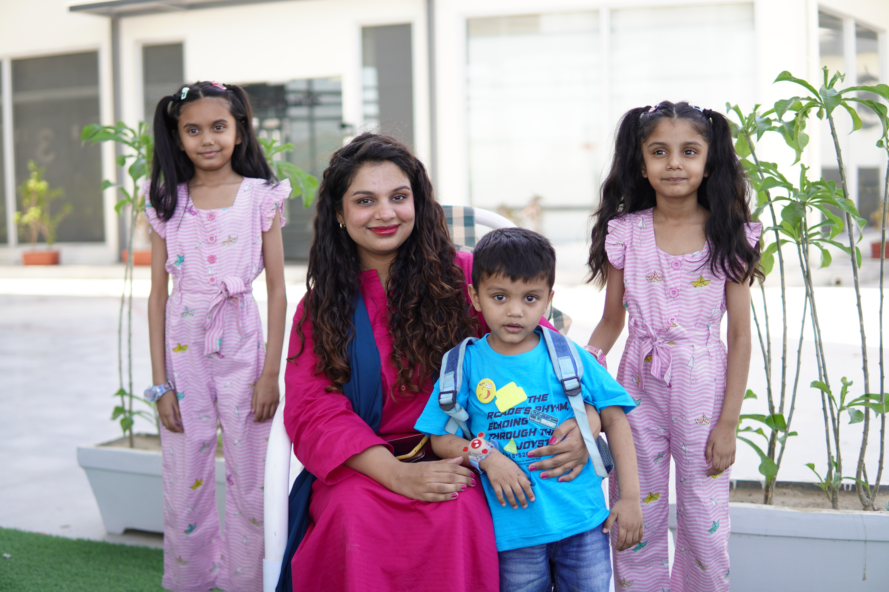
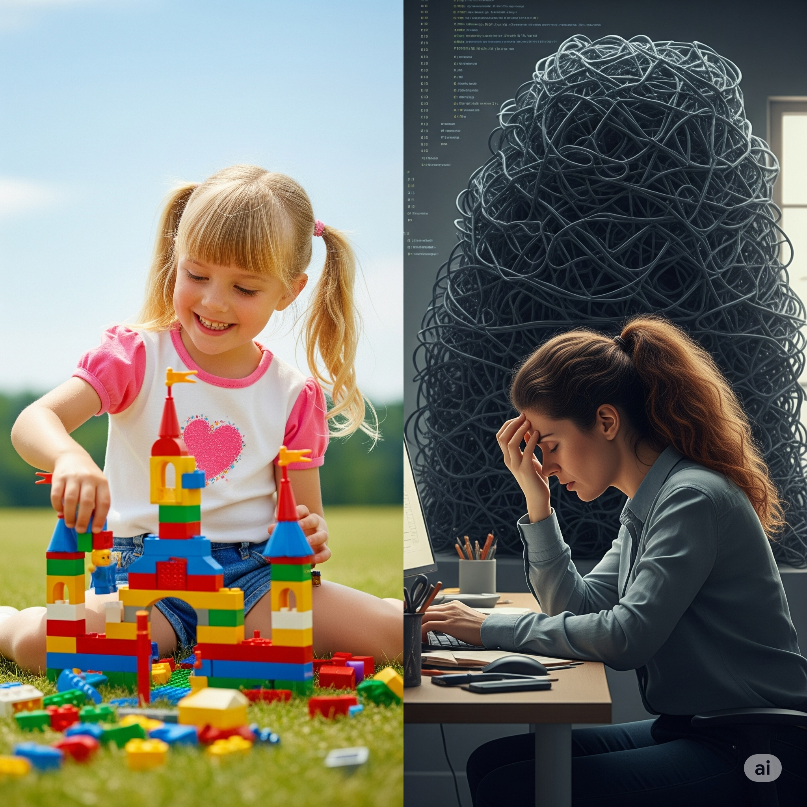
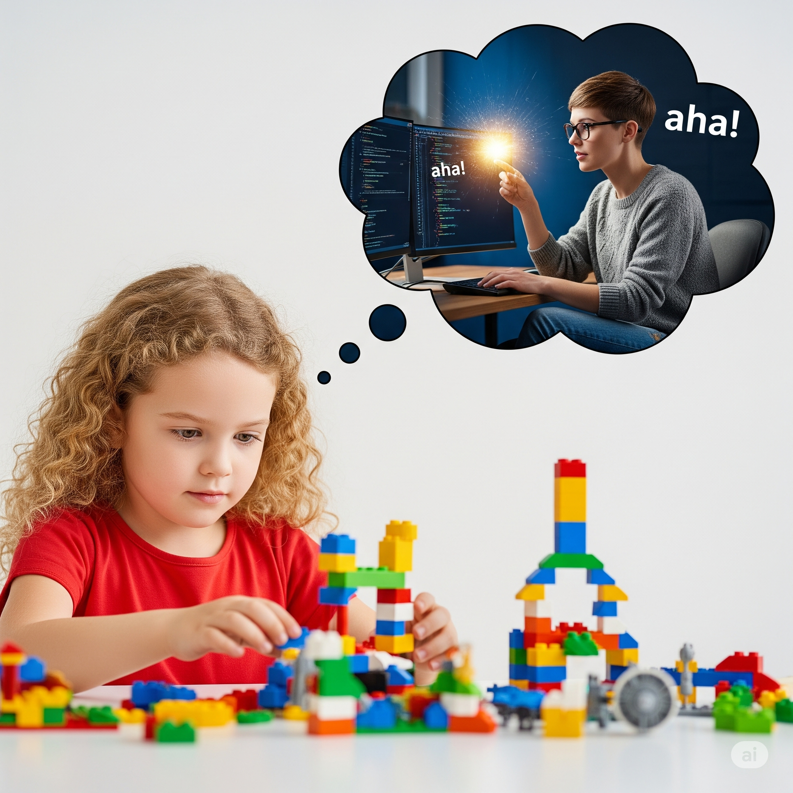

# Microfrontends for 5-year-olds

And their brilliant senior developer parents!

  But first, here's a bit about me <carbon:arrow-right />

---

## Who Am I?

  

<v-click> 
  
</v-click>
<v-click> 
  
</v-click>
<v-click> 
  
</v-click>

  

<v-clicks>

- 💻 [https://medium.com/@ingila185](https://www.linkedin.com/in/ingila-ejaz)
- 📫 [ingila185@gmail.com](mailto:ingila185@gmail.com)
- 💼 [https://www.linkedin.com/in/ingila-ejaz](https://www.linkedin.com/in/ingila-ejaz)

</v-clicks>

---

## From Childhood Bricks to Digital Giants: Meet the Monolith

  

---

## The Lightbulb Moment: Building Web Apps, Just Like LEGOs!

  

---

## What are microfrontends?
